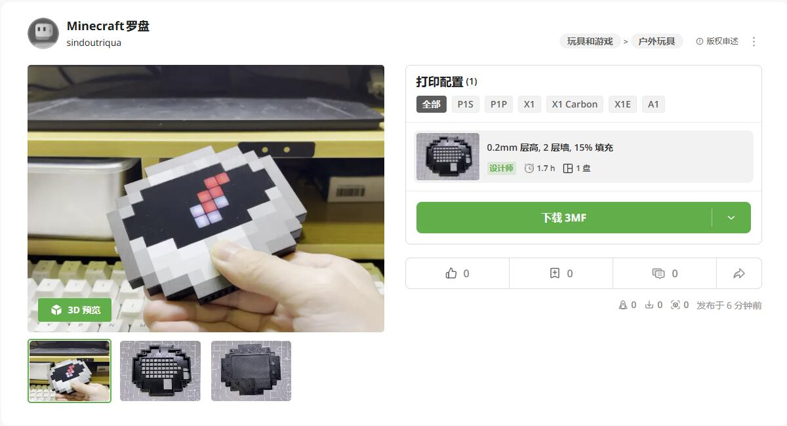

# 制作

## 源码
[Github](https://github.com/chaosgoo/mcompass)

## 模型
[MakerWorld CN](https://makerworld.com.cn/zh/models/667420#profileId-611642)

## PCB

[PCB工程文件和面板](https://oshwhub.com/chaosgoo/wcompass)

## 材料说明
* PCB板厚选择1.0mm, 黑色;
* 面板选择1.0mm 半透黑色亚克力,无需背胶;
* 匀光材料选择PET LGT075J,无需背胶;
* 电池选择 213455 500MAH
* 滚花螺母 M2*3*3.2
* 螺丝 M2*4 内六角